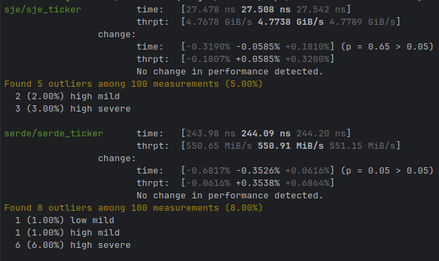

[](https://actions-badge.atrox.dev/havefuntrading/sje/goto?ref=main)
[](https://crates.io/crates/sje)
[](https://docs.rs/sje/)
[](LICENSE)

# Simple Json Encoding

Fast JSON deserialisation and serialisation schema based framework.

## Examples

Make sure the `derive` feature is enabled.

```toml
sje = { version = "0.0.4", features = ["derive"]}
```

Simply annotate your struct using `#[sje]` attribute, The `len` field can be used when you know the exact size of the value field which means the
decoder can handle it more efficiently.

```rust
#[derive(Decoder)]
#[sje(object)]
pub struct Trade {
    #[sje(rename = "e", len = 5)]
    event_type: String,
    #[sje(rename = "E", len = 13)]
    event_time: u64,
    #[sje(rename = "s")]
    symbol: String,
    #[sje(rename = "t", len = 10)]
    trade_id: u64,
    #[sje(rename = "p")]
    price: String,
    #[sje(rename = "q")]
    quantity: String,
    #[sje(rename = "b", len = 11)]
    buyer_order_id: u64,
    #[sje(rename = "a", len = 11)]
    seller_order_id: u64,
    #[sje(rename = "T", len = 13)]
    transaction_time: u64,
    #[sje(rename = "m")]
    is_buyer_maker: bool,
}

let trade = TradeDecoder::decode(br#"{"e":"trade","E":1705085312569,"s":"BTCUSDT","t":3370034463,"p":"43520.00000000","q":"0.00022000","b":24269765071,"a":24269767699,"T":1705085312568,"m":true,"M":true}"#).unwrap();
assert_eq!("trade", trade.event_type_as_str());
assert_eq!(1705085312569, trade.event_time());
```

We can also handle arrays and tuples. In this case if we want to use generated `PositionDecoder` we need to explicitly mark it with `decoder = true`.

```rust
#[derive(Decoder)]
#[sje(object)]
struct Position {
    #[sje(rename = "s")]
    symbol: String,
    #[sje(rename = "a")]
    amount: u32,
}

#[derive(Decoder)]
#[sje(object)]
struct PositionUpdate {
    #[sje(rename = "t")]
    timestamp: u64,
    #[sje(rename = "u", decoder = true)]
    updates: Vec<Position>,
}
```

The generated code will contain iterators that already know the length of the array.

```rust
let update = PositionUpdateDecoder::decode(br#"{"t":1746699621,"u":[{"s":"btcusdt","a":100},{"s":"ethusdt","a":200}]}"#).unwrap();
assert_eq!(2, update.updates_count());

let mut updates = update.updates().into_iter();

let position = updates.next().unwrap();
assert_eq!("btcusdt", position.symbol_as_str());
assert_eq!(100, position.amount());

let position = updates.next().unwrap();
assert_eq!("ethusdt", position.symbol_as_str());
assert_eq!(200, position.amount());

assert!(positions.next().is_none());
```

The framework also handles user defined types that don't require an explicit `Decoder`. In this case, the only requirement is that the type
implements `FromStr` trait. We also need to tell the parser what is the underlying json type for our user defined type, in this case `ty = "string"`.

```rust
#[derive(Copy, Clone, Eq, PartialEq, Debug)]
struct Price(u64);

impl FromStr for Price {
    type Err = &'static str;

    fn from_str(s: &str) -> Result<Self, Self::Err> {
        Ok(Self(s.parse().map_err(|_| "unable to parse the price")?))
    }
}

#[derive(Decoder)]
#[sje(object)]
pub struct Trade {
    #[sje(rename = "p", ty = "string")]
    price: Price,
}

let trade = TradeDecoder::decode(br#"{"p":"12345"}"#).unwrap();
assert_eq!(Price(12345), trade.price());
```

## Benchmarks

There are [benchmarks](sje/benches) against [serde_json](https://crates.io/crates/serde_json) that show an order of magnitude
speedup. Please note `sje` is not a generic purpose json parser - it's fast because it takes advantage of fixed schema and
lacks a lot of features you would find in `serde` to handle more dynamic content.

```shell
RUSTFLAGS='-C target-cpu=native' cargo bench --bench=ticker
```
